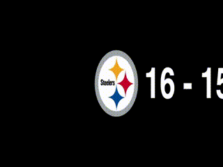
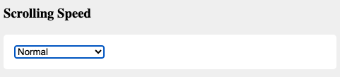
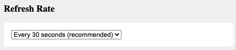
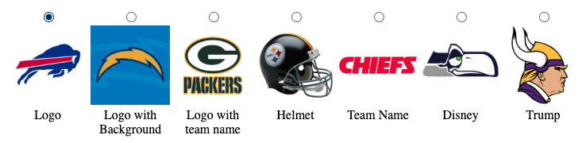
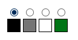
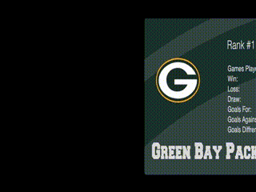
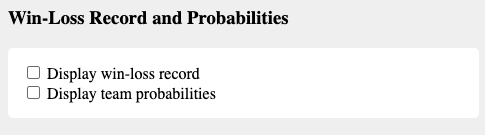
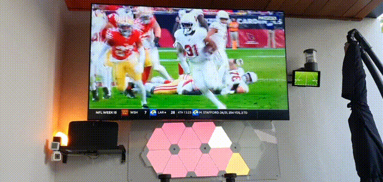
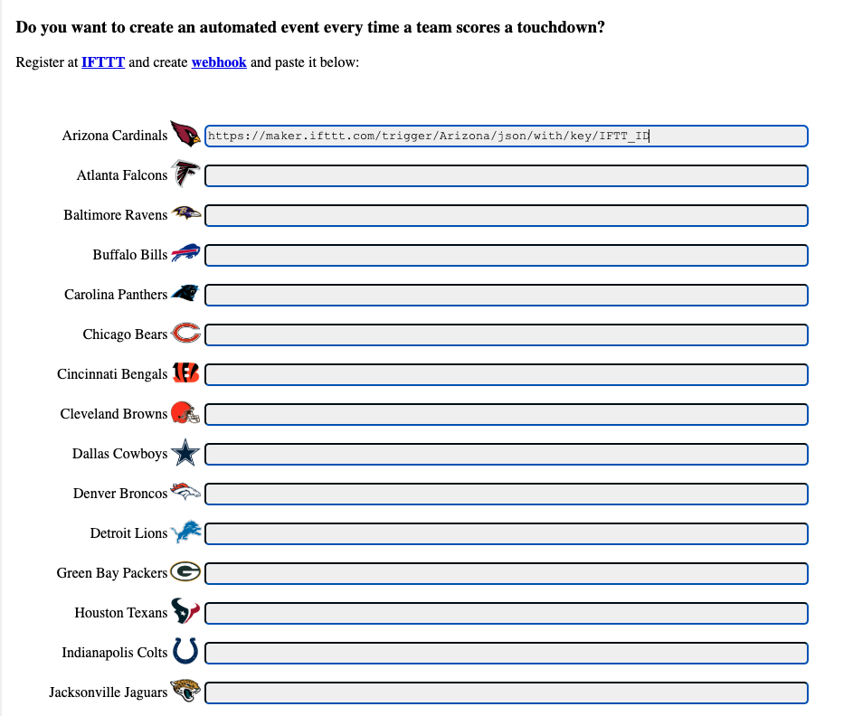

# SCROLLING SCORES 🏈

Welcome to **SCROLLING SCORES**, your ultimate real-time score-tracking app for all NFL games. Whether you're a die-hard football fan or simply want to keep up-to-date with touchdowns, plays, and results, SCROLLING SCORES provides continuous live updates.

With SCROLLING SCORES, you won’t miss a touchdown, field goal, or key moment again. Customizable themes, animated interfaces, and live game action make this the perfect app for football lovers.

 
---

## Features

- **Live Score Updates**: Keep track of NFL games with up-to-the-second updates. 
 

- **Customizable Themes**: 
  - Choose from logos, helmets, team names, or fun themes.
  - Multiple background styles such as solid colors or images.
- **Interactive Settings**:
  - Pick scrolling speed (from "Super Slow" to "Speedy Gonzales").
  - Adjust refresh rate (every 5 minutes to every 15 seconds).
  
- **Game Statistics**: 
  - Team Rank 
  - View live probabilities 

- **Touchdown Notifications**:
  - Configure custom alerts and events using IFTTT when your favorite team scores.
- **Team-Specific Settings**: Register IFTTT webhooks for individual NFL teams.
- **Automatic Refresh**: Scores refresh based on user preferences.
- **Downloadable App**:
  - Available for [iOS](https://apps.apple.com/mx/app/scrolling-score/id6736430610?l=en-GB).
  - Download APK for [Android](https://nfl-scores.s3.us-west-1.amazonaws.com/Web/ScrollingScore.apk).

---

## Table of Contents 📚

1. [Preview](#preview-📊)
2. [Setup and Usage Instructions](#setup-and-usage-instructions-🚀)
3. [Customizable Settings](#customizable-settings-⚙️)

---

## Preview
   

## Setup and Usage Instructions 🚀

1. Clone or download the repository:
   ```bash
   git clone https://github.com/username/scrolling-scores.git
   ```
2. Open the `index.html` file in your browser to start the app.

3. To interact with live-score APIs:
   - Replace the `API_KEY` field in the settings screen with a valid key.
   - Configure other settings like refresh rate, themes, and animations to suit your preferences.

4. Customize team-specific contributions:
   - Register at [IFTTT](https://ifttt.com/) and set up a webhook.
   - Configure the webhook in the **Trigger Actions on Touchdowns** section.

5. Interact with the screen to trigger animations:
   - **Click** to pause or resume scrolling.
   - **Scroll** to explore more settings or matches.

---

## Customizable Settings ⚙️

### API Key 🔑
- Configure your **API Key** for authorized data retrieval. (note: API key ***DISABLED FOR NOW***)

### Scrolling Speed Settings 🕓
Control how fast the scores scroll across the screen. 
- Options: **Super Slow**, **Normal**, **Fast**, **Speedy Gonzales**, etc.

### Refresh Rate Settings 🔄
Determine how frequently scores update automatically.
- Options: From **every 5 minutes** to **every 15 seconds**.


### Themes 🎨

Change up the visuals to fit your vibe:
- Default: Team Logos
- Helmet View
- Team Names
- Fun Themes


### Background Colors 
Set the mood with solid backgrounds or football field image-based designs. \

### Game Statistics 
Team Rank \
  

View live probabilities \
  


### Touchdown Alerts 📣
Configure custom animations or trigger IFTTT events when a touchdown occurs. 




Example:
```text
https://maker.ifttt.com/trigger/
```
https://ifttt.com/explore/what-are-webhooks




---
### Connect
For support or comments, please reach out:
- Email: camposguillermo@hotmail.com

Happy score scrolling! 🏈
